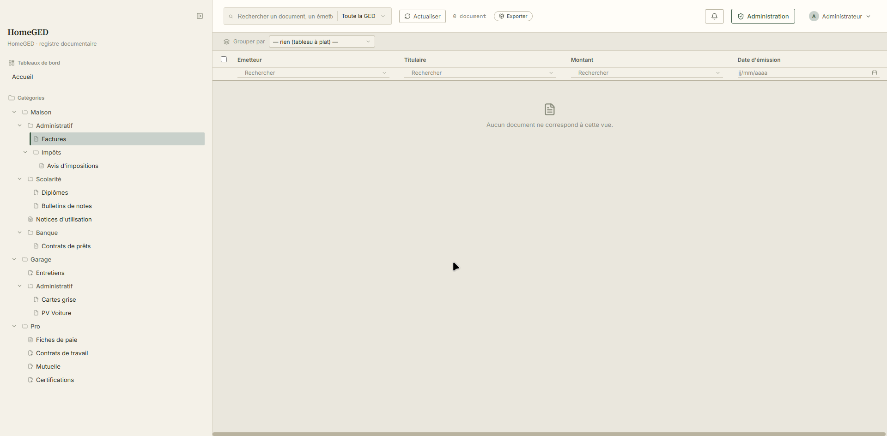
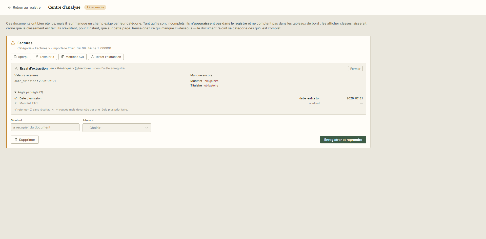
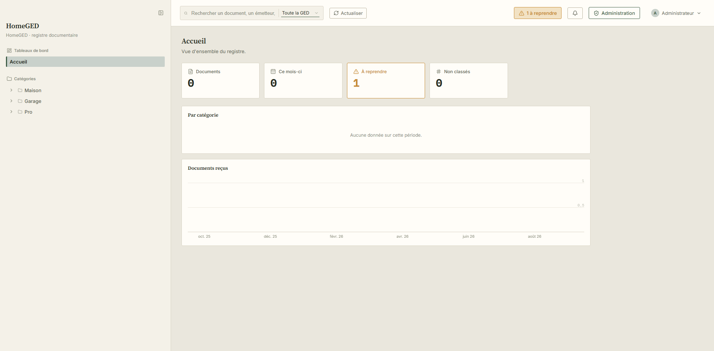
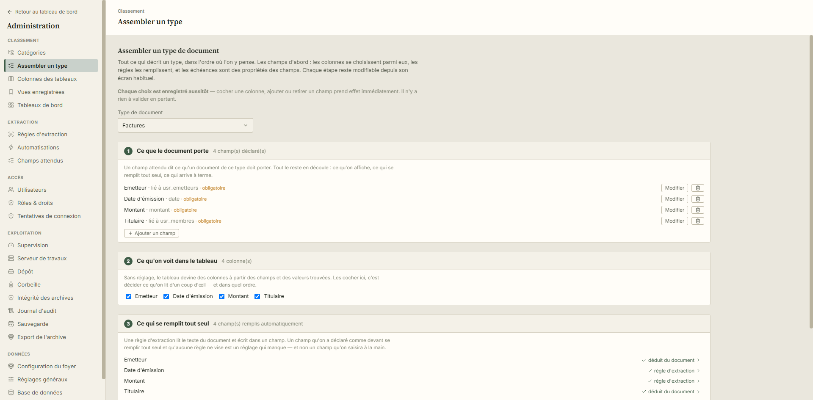

# HomeGED - Vibe coded with Claude Code

**Le classeur du foyer.** On dépose un scan ou une photo dans le dossier de son
type de document ; HomeGED l'océrise, en extrait ce qui l'identifie : émetteur,
date, numéro, montant, l'archive et le rend cherchable. Ce qu'on cherchait
dans une chemise cartonnée se retrouve en tapant trois lettres.

Ce n'est pas un service en ligne : c'est **votre machine, vos fichiers**. Quatre
conteneurs Docker, une base MariaDB, et les PDF sur votre disque, lisibles sans
l'application.



## Ce que ça fait, concrètement

| | |
|---|---|
| **Ranger sans y penser** | Un dossier de dépôt par type de document. Le fichier posé dedans dit ce qu'il est ; le reste est déduit. |
| **Lire à votre place** | Océrisation, puis des règles d'extraction  écrites à la main, ou **apprises en désignant la valeur sur la page**. |
| **Chercher sans savoir où** | Recherche plein texte sur le contenu, l'émetteur, le classement, les champs extraits et les choses désignées (« Clio », « Orange »). |
| **Dire ce qui manque** | Chaque type déclare les champs qu'il exige. Un document incomplet n'entre pas au registre : il attend au Centre d'analyse. |
| **Ne rien perdre** | Corbeille, versions, contrôle d'intégrité des archives, journal d'audit, et une copie de secours réglable. |
| **Chacun ses papiers** | Comptes, rôles, droits par catégorie et par action, double authentification. |







**Le classement ne se devine pas : il se déclare.** L'arborescence distingue les
**dossiers**, qui organisent, des **types de document**, qui portent les
documents et tout ce qui les décrit : colonnes, champs attendus, règles de
lecture. Chaque type a son dossier de dépôt : c'est l'endroit où l'on pose un
fichier.

## Configuration recommandée

Les chiffres qui suivent sont **mesurés**, sur un Xeon E5-2470 v2 (2013, 10
cœurs, 2,4 GHz) et 16 Go de mémoire.

| Taille du foyer | Processeur | Mémoire | Disque |
|---|---|---|---|
| jusqu'à 5 000 documents | 2 cœurs | 4 Go | 20 Go + vos PDF |
| jusqu'à 20 000 documents | 4 cœurs | 8 Go | 60 Go + vos PDF |
| au-delà | 4 cœurs et plus | 8 Go et plus | 80 Go et + |

## Architecture
Quatre services Docker : `db` (MariaDB), `worker` (OCR et traitements),
`api` (FastAPI) et `frontend` (React servi par nginx, qui relaie `/api/`).

| Service | Port publié | Remarque |
|---|---|---|
| frontend | `8081` | l'interface web |
| api | `8001` | utile seulement pour scripter |
| db | `127.0.0.1:3307` | volontairement non exposée au réseau local |
| worker | `N/A` | serveur de travaux |

## Démarrage rapide

```bash
cp .env.example .env      # puis renseigne les mots de passe et la clé secrète
docker compose up -d --build
```

Interface : **http://localhost:8081**. Au premier démarrage, un compte
administrateur est créé à partir de `ADMIN_EMAIL` / `ADMIN_PASSWORD`.

> `SECRET_KEY` signe les jetons de session : génère-la avec
> `openssl rand -hex 32`. L'API refuse de démarrer si elle vaut encore la valeur
> d'exemple, et avertit en dessous de 32 caractères.

Dépose ensuite un PDF ou une image dans le dossier du type de document
correspondant, sous `./ocr_wait/` : il est océrisé, indexé, et archivé dans
`./storage/AAAA/MM/`.

> **Ces dossiers appartiennent à la GED.** Elle en tient un par type de document,
> les crée et les renomme elle-même ; on y dépose, on n'y crée rien. Un fichier
> posé ailleurs  à la racine, ou dans un dossier ajouté à la main  n'est
> rattaché à aucun type.

## API

`http://localhost:8001`, jeton via `POST /auth/login` puis en-tête
`Authorization: Bearer <token>`.

| Route | Usage |
|---|---|
| `GET /documents?q=facture` | recherche plein texte |
| `GET /documents?categorie_id=3` | filtre par catégorie, sous-catégories comprises |
| `GET /documents?filtres=[…]` | filtres combinés (cf. `app/filtres.py`) |
| `GET /documents?tri=…&sens=…` | tri ; `limite`/`decalage` paginent, total en en-tête `X-Total-Count` |
| `GET /documents/{id}` et `/fichier` | détail, PDF océrisé (droit « télécharger ») |
| `PATCH` et `DELETE /documents/{id}` | correction, mise à la corbeille |
| `GET /analyse` | documents auxquels il manque un champ |
| `GET /a-classer`, `POST /a-classer/{id}` | fichiers sans type, et leur classement |
| `GET /vues`, `GET /references/{table}` | vues enregistrées, valeurs d'un champ personnalisé |
| `/admin/*` | administration ; chaque route exige son droit |

Documentation interactive : `http://localhost:8001/docs`.

## Documentation

Le [wiki](wiki/) contient les procédures détaillées, séparées selon qui les lit :

* **pour qui s'en sert**  premiers pas, déposer, chercher, le Centre d'analyse,
  son compte ;
* **pour qui l'administre**  installation, classement, règles d'extraction,
  comptes et droits, **sauvegarde et restauration**, **sécurité avancée**
  (fail2ban, HTTPS, restreindre `/admin` et `/api/admin/`), thèmes et langues,
  performances, dépannage.

`wiki/README.md` explique comment le publier dans le wiki GitHub du dépôt, et
liste les captures d'écran attendues avec ce qui doit y figurer.
